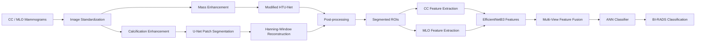
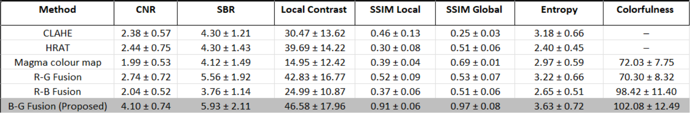
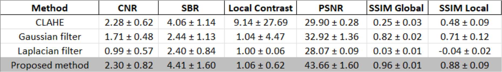
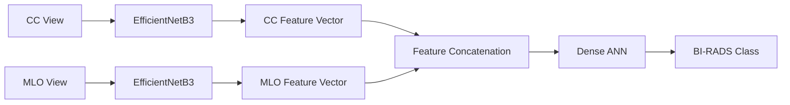

# 🩺 Unified Multi-View Mammogram Analysis

[](https://www.python.org/)
[](https://pytorch.org/)
[](https://www.tensorflow.org/)
[](https://opencv.org/)
[](#-research-outputs)
[](#-recognition)

> **Research and publication archive for an end-to-end deep learning framework for mammogram enhancement, abnormality segmentation, and multi-view BI-RADS classification.**
>
> The project combines abnormality-specific image enhancement, dual-path segmentation, and multi-view deep learning to analyze breast masses and calcifications from CC and MLO mammograms.


---

## 🏆 Recognition

**Best Final Year Project**  
Department of Electrical and Electronic Engineering  
University of Sri Jayewardenepura, Sri Lanka

The project was recognized for its research contribution and integration of image processing, deep learning, segmentation, and multi-view classification within a unified mammography-analysis framework.

<p align="center">
  
</p>

---

## 📖 Project Overview

Mammographic analysis requires identifying abnormalities such as **breast masses** and **calcifications**, which differ considerably in size, structure, distribution, and visual appearance.

Rather than applying a single processing strategy to both abnormality types, this project developed a multi-stage framework consisting of:

1. **Mammogram standardization**
2. **Abnormality-specific image enhancement**
3. **Dual-path segmentation**
4. **Post-processing and ROI fusion**
5. **Multi-view deep feature extraction**
6. **BI-RADS classification using complementary CC and MLO views**

The framework was evaluated using the **INBreast mammography dataset**.

> **Research Use Notice:** This project was developed for academic research and engineering evaluation. It is not a medical device and should not be used for independent clinical diagnosis or treatment decisions.

---

## 📊 Key Results

| Stage | Method | Reported Result |
|---|---|---:|
| **Multi-View Classification** | EfficientNetB3 + ANN | **87.55% Accuracy** |
| **Mass Segmentation** | Modified HTU-Net | **0.6064 DSC** |
| **Mass Segmentation** | Modified HTU-Net | **0.5988 Precision** |
| **Calcification Segmentation** | U-Net | **0.8022 DSC** |
| **Calcification Segmentation** | U-Net | **0.8958 Precision** |
| **Mass Enhancement** | B-G Fusion | **4.10 ± 0.74 CNR** |
| **Calcification Enhancement** | Proposed Gaussian-Based Method | **43.66 ± 1.60 PSNR** |

### Enhancement Highlights

- The proposed **B-G fusion** method achieved a mean CNR of **4.10**, compared with **2.38** for CLAHE — approximately a **72% increase in CNR**.
- The proposed calcification-enhancement method achieved a mean PSNR of **43.66**, compared with **29.90** for CLAHE — approximately a **46% increase in PSNR**.

> Enhancement percentages are relative improvements calculated from the corresponding mean metric values. Classification, segmentation, and enhancement metrics describe different stages of the pipeline and should not be directly compared with one another.


---

## 🏗️ System Architecture

The project combines preprocessing, segmentation, reconstruction, feature extraction, and multi-view classification within a unified pipeline.



---

# 🧩 Methodology

## 1. Mammogram Standardization

The preprocessing stage converts mammograms into a consistent representation while preserving anatomical structure.

The workflow includes:

- DICOM image handling
- CC and MLO mammogram processing
- Breast-region extraction using contour detection
- Pectoral-region handling for MLO images
- Aspect-ratio-preserving resizing
- Standardization to **1024 × 1024 pixels**
- Laterality-aware zero-intensity padding

<p align="center">
  
</p>

<p align="center">
  
</p>

---

## 2. Dual-Path Image Enhancement

Masses and calcifications have substantially different visual characteristics.

The framework therefore uses separate enhancement pipelines optimized for each abnormality type.

## 2.1 Mass Enhancement

The breast-mass enhancement workflow applies:

1. **Contrast Limited Adaptive Histogram Equalization (CLAHE)**
2. Global intensity thresholding
3. **Magma colour mapping**
4. RGB channel decomposition
5. Pairwise channel fusion:
   - R-G Fusion
   - R-B Fusion
   - B-G Fusion

The proposed **B-G Fusion** produced the strongest overall results across the evaluated enhancement and similarity metrics.

<p align="center">
  
</p>

<p align="center">
  
</p>

### Quantitative Mass-Enhancement Results

| Method | CNR | SBR | Local Contrast | SSIM Local | SSIM Global | Entropy | Colorfulness |
|---|---:|---:|---:|---:|---:|---:|---:|
| CLAHE | 2.38 ± 0.57 | 4.30 ± 1.21 | 30.47 ± 13.62 | 0.46 ± 0.13 | 0.25 ± 0.03 | 3.18 ± 0.66 | — |
| HRAT | 2.44 ± 0.75 | 4.30 ± 1.43 | 39.69 ± 14.22 | 0.30 ± 0.08 | 0.51 ± 0.06 | 2.40 ± 0.45 | — |
| Magma Colour Map | 1.99 ± 0.53 | 4.12 ± 1.49 | 14.95 ± 12.42 | 0.39 ± 0.04 | 0.69 ± 0.01 | 2.97 ± 0.59 | 72.03 ± 7.75 |
| R-G Fusion | 2.74 ± 0.72 | 5.56 ± 1.92 | 42.83 ± 16.77 | 0.52 ± 0.09 | 0.53 ± 0.07 | 3.22 ± 0.66 | 70.30 ± 8.32 |
| R-B Fusion | 2.04 ± 0.52 | 3.76 ± 1.14 | 24.99 ± 10.87 | 0.37 ± 0.06 | 0.51 ± 0.06 | 2.65 ± 0.51 | 98.42 ± 11.40 |
| **B-G Fusion (Proposed)** | **4.10 ± 0.74** | **5.93 ± 2.11** | **46.58 ± 17.96** | **0.91 ± 0.06** | **0.97 ± 0.08** | **3.63 ± 0.72** | **102.08 ± 12.49** |

<!-- <p align="center">
  
</p> -->

### Key Observation

The proposed **B-G Fusion** achieved the highest reported values across the main evaluated metrics:

- **CNR:** 4.10 ± 0.74
- **SBR:** 5.93 ± 2.11
- **Local Contrast:** 46.58 ± 17.96
- **SSIM Local:** 0.91 ± 0.06
- **SSIM Global:** 0.97 ± 0.08
- **Entropy:** 3.63 ± 0.72
- **Colorfulness:** 102.08 ± 12.49

Using CLAHE as the comparison baseline for CNR:

```text
(4.10 - 2.38) / 2.38 × 100 ≈ 72.3%
```

Therefore, the proposed B-G Fusion produced approximately a **72% higher mean CNR than CLAHE** under the reported experimental conditions.


### Calcification Enhancement

Calcifications are small, high-intensity structures and require a different enhancement strategy.

The calcification pipeline applies:

1. Gaussian low-pass filtering
2. Subtraction from the standardized mammogram to extract high-frequency components
3. Rectification of negative responses
4. Secondary Gaussian smoothing
5. Adaptive thresholding
6. Binary-mask generation
7. Overlay on the standardized mammogram

<p align="center">
  
</p>

### Quantitative Calcification-Enhancement Results

| Method | CNR | SBR | Local Contrast | PSNR | SSIM Global | SSIM Local |
|---|---:|---:|---:|---:|---:|---:|
| CLAHE | 2.28 ± 0.62 | 4.06 ± 1.14 | 9.14 ± 27.69 | 29.90 ± 0.28 | 0.25 ± 0.03 | 0.48 ± 0.09 |
| Gaussian Filter | 1.71 ± 0.48 | 2.44 ± 1.13 | 1.04 ± 4.47 | 32.92 ± 1.36 | 0.82 ± 0.02 | 0.71 ± 0.12 |
| Laplacian Filter | 0.99 ± 0.57 | 2.40 ± 0.84 | 1.00 ± 0.06 | 28.07 ± 0.09 | 0.03 ± 0.01 | -0.04 ± 0.02 |
| **Proposed Method** | **2.30 ± 0.82** | **4.41 ± 1.60** | **1.06 ± 0.62** | **43.66 ± 1.60** | **0.96 ± 0.01** | **0.88 ± 0.09** |

<!-- <p align="center">
  
</p> -->

### Key Observation

The proposed calcification-enhancement method achieved:

- **CNR:** 2.30 ± 0.82
- **SBR:** 4.41 ± 1.60
- **PSNR:** 43.66 ± 1.60
- **SSIM Global:** 0.96 ± 0.01
- **SSIM Local:** 0.88 ± 0.09

Using CLAHE as the comparison baseline for PSNR:

```text
(43.66 - 29.90) / 29.90 × 100 ≈ 46.0%
```

The proposed method therefore achieved approximately a **46% higher mean PSNR than CLAHE** under the reported experimental conditions.

> Individual enhancement metrics characterize different properties of image quality. The proposed method should therefore be interpreted using the complete metric set rather than a single metric in isolation.

---

# 3. Dual-Path Segmentation

Masses and calcifications differ significantly in morphology, scale, and distribution.

A **dual-path segmentation framework** was therefore developed instead of forcing both abnormalities through the same model architecture.

```text
Mass-Enhanced Mammogram
        ↓
Modified HTU-Net
        ↓
Mass Mask

Calcification-Enhanced Mammogram
        ↓
Overlapping Patches
        ↓
U-Net
        ↓
Hanning-Window Reconstruction
        ↓
Calcification Mask

Mass Mask + Calcification Mask
        ↓
Post-processing & Fusion
```

---

## Mass Segmentation — Modified HTU-Net

Breast masses are segmented using a modified **Hybrid Transformer U-Net (HTU-Net)**.

The architecture combines convolutional feature extraction with transformer-based attention.

### Architectural Modifications

- Encoder-decoder architecture based on U-Net
- **Spatial-Channel Enhanced Self Attention (SCESA)**
- **Multi-Head Attention (MHA)** at the bottleneck
- Depthwise convolution within the attention mechanism
- Conv2D-based positional representation
- Preservation of 2D spatial feature maps rather than conventional transformer patch flattening

These modifications were designed to capture both local structural information and broader contextual relationships.

### Performance

| Metric | Result |
|---|---:|
| Dice Similarity Coefficient | **0.6064** |
| Precision | **0.5988** |

<p align="center">
  
</p>

---

## Calcification Segmentation — U-Net + Patch Reconstruction

Calcifications occupy very small regions relative to the full-resolution mammogram.

To preserve fine details, calcification segmentation uses an overlapping patch-based strategy.

### Patch Configuration

- Patch size: **64 × 64 pixels**
- Stride: **32 pixels**
- Overlapping patch extraction
- U-Net segmentation
- Weighted image reconstruction

### Hanning-Window Reconstruction

Predicted patches are merged using a **cosine-based Hanning window**.

This weighted reconstruction:

- smooths transitions between overlapping patches
- reduces patch-boundary artifacts
- improves continuity in the reconstructed segmentation mask

### Performance

| Metric | Result |
|---|---:|
| Dice Similarity Coefficient | **0.8022** |
| Precision | **0.8958** |

<p align="center">
  
</p>

---

## Post-processing and Output Fusion

Different post-processing strategies are applied to the two segmentation paths.

### Mass Masks

- Probability thresholding
- Binary-mask generation
- Removal of small isolated regions
- Morphological closing
- Largest-connected-component selection

### Calcification Masks

- Reconstruction of overlapping segmentation patches
- Morphological processing
- Breast-boundary suppression
- Mask normalization and refinement

The final system overlays the processed outputs from both pathways to generate a unified abnormality representation.

<p align="center">
  
</p>

### Segmentation Results

<p align="center">
  
</p>

<p align="center">
  
</p>

---

# 4. Multi-View Classification

After preprocessing and ROI analysis, the framework performs classification using complementary information from the **CC and MLO mammographic views**.

Multiple classification approaches were evaluated, including:

- Single-view CNN
- Multi-view CNN
- **EfficientNetB3 + ANN**

The EfficientNetB3-based approach was selected for the final classification pipeline.

---

## EfficientNetB3 Feature Extraction

A pre-trained **EfficientNetB3** backbone is used for deep feature extraction.

The classification workflow consists of:

1. Processing mammographic views through EfficientNetB3
2. Global average pooling
3. Extraction of deep feature vectors
4. Fusion of information from complementary mammographic views
5. Classification using dense ANN layers



### Training Configuration

- ImageNet-pretrained EfficientNetB3
- Deep feature extraction
- Global average pooling
- Feature extraction from complementary mammographic views
- Multi-view feature concatenation
- Dense ANN classification
- Adam optimizer
- Learning rate: **0.0005**
- **5-fold cross-validation**


---

## Class-Imbalance Handling

The BI-RADS categories are not uniformly represented within the dataset.

An enhanced **SMOTE strategy with adaptive nearest-neighbor selection** was used to improve class balance during model development.

---

## Classification Results

The final multi-view classification pipeline achieved:

### **87.55% Classification Accuracy**

<p align="center">
  
  
</p>

---

# 🔬 Research Contributions

The project investigated a unified mammography-analysis framework spanning multiple stages of the AI pipeline:

1. **Abnormality-specific enhancement** for breast masses and calcifications
2. **Quantitative preprocessing evaluation** using CNR, SBR, Local Contrast, SSIM, PSNR, Entropy, and Colorfulness
3. **Modified HTU-Net segmentation** for breast masses
4. **Patch-based U-Net segmentation** for calcifications
5. **Hanning-window weighted reconstruction** of calcification predictions
6. **Post-processing and segmentation-output fusion**
7. **EfficientNetB3-based deep feature extraction**
8. **Multi-view CC/MLO feature fusion**
9. **ANN-based BI-RADS classification**
10. Quantitative evaluation across enhancement, segmentation, and classification stages

The work resulted in three research publications covering complementary components of the complete framework.


---

# 📚 Research Outputs

This project contributed to three research publications covering preprocessing, segmentation, and classification.

### 1. A Unified Deep Learning Approach for the Segmentation of Breast Masses and Calcifications

**Authors:** **T.D. Wickramasingha**, S.A.A.J.M. Athukorala, S.M.D. Deepashika, I.A.S.I. Fernando, U.L. Wijewardhana, U.B. Balagalla  
**Conference:** MERCon 2025  
**Focus:** Unified segmentation of breast masses and calcifications using modified HTU-Net and U-Net.

📄 [IEEE Xplore](https://ieeexplore.ieee.org/document/11217096)

---

### 2. Dual-Path Enhancement Framework for Masses and Calcifications in Mammograms

**Authors:** S.A.A.J.M. Athukorala, S.M.D. Deepashika, **T.D. Wickramasingha**, et al.  
**Conference:** TENCON 2025  
**Focus:** Quantitative evaluation of abnormality-specific mammogram enhancement pipelines.

📄 [IEEE Xplore](https://ieeexplore.ieee.org/document/11375512)

---

### 3. Multi View Mammogram Analysis with Segmented Breast Masses and Calcifications for BI-RADS Classification

**Authors:** S.M.D. Deepashika, **T.D. Wickramasingha**, et al.  
**Conference:** ICARC 2026  
**Focus:** Integration of preprocessing, segmentation, and multi-view classification for BI-RADS categorization.

📄 [IEEE Xplore](https://ieeexplore.ieee.org/document/11453577)

---

# 💻 Code Availability

This repository primarily serves as a **research and publication archive** for the Unified Multi-View Mammogram Analysis project.

The original system was developed iteratively through multiple experimental **Google Colab** workflows during the research period.

The surviving development notebooks represent intermediate experimental versions and do **not fully reproduce the final methodology** reported in the associated research publications.

Some surviving notebooks contain earlier model architectures, image resolutions, patch configurations, reconstruction strategies, and experimental training settings that differ from the final published methodology.

To avoid presenting incomplete or potentially misleading implementation code as the final research system, these experimental notebooks are **not published here as the project's reference implementation**.

This repository therefore focuses on the parts of the project that can be reliably documented and verified:

- system architecture
- methodology
- experimental configurations
- quantitative results
- figures and visual outputs
- research publications
- project recognition

The associated papers provide detailed descriptions of the preprocessing, segmentation, reconstruction, classification, and evaluation methodologies used in the reported studies.

> If a reconstructed reference implementation is added in the future, it will be clearly identified as a **reimplementation based on the published methodology**, rather than the original experimental source code used to generate the reported results.

---


# 🧰 Technology Stack

### Deep Learning

- PyTorch
- TensorFlow
- EfficientNetB3
- Modified HTU-Net
- U-Net
- Artificial Neural Networks

### Computer Vision & Image Processing

- OpenCV
- CLAHE
- Gaussian filtering
- Magma colour mapping
- Morphological processing
- Hanning-window patch reconstruction

### Evaluation

- Dice Similarity Coefficient
- Precision
- Contrast-to-Noise Ratio (CNR)
- Signal-to-Background Ratio (SBR)
- Local Contrast
- Structural Similarity Index (SSIM)
- Peak Signal-to-Noise Ratio (PSNR)
- Entropy
- Colorfulness
- Cross-validation

### Programming & Machine Learning

- Python
- NumPy
- Scikit-learn


---

# ⚠️ Research Use Disclaimer

This repository documents an **academic research project**.

The proposed methods were evaluated under the datasets, preprocessing procedures, experimental configurations, and validation settings described in the associated research work.

The system is **not a medical device** and is not intended for independent clinical diagnosis, screening, treatment, or patient-management decisions.

Further external validation would be required before considering real-world clinical application.

---

# 🚀 Future Work

Potential extensions include:

- Validation using additional multi-institutional mammography datasets
- External validation across different imaging systems and populations
- Improved uncertainty estimation
- Explainability techniques such as **Grad-CAM**
- More advanced multi-view feature-fusion strategies
- Expanded malignancy-related classification
- Investigation of newer vision and transformer architectures
- Development of a clean reconstructed reference implementation based on the published methodology

---

# 🤝 Acknowledgements

- **INBreast** — Mammography dataset used for research and evaluation
- **University of Sri Jayewardenepura** — Academic supervision and project support
- **PyTorch** — Deep learning experimentation
- **TensorFlow / Keras** — Deep learning and classification experimentation
- **OpenCV** — Image-processing and computer-vision operations

---

# 👤 Author

**Tirush Dumil Wickramasingha**

[GitHub](https://github.com/Tirush-Leo) •
[LinkedIn](https://www.linkedin.com/in/tirush-dumil/) •
[Google Scholar](https://scholar.google.com/citations?user=WRrjwsoAAAAJ&hl=en)
