# 🩺 Unified Multi-View Mammogram Analysis

[](https://www.python.org/)
[](https://pytorch.org/)
[](https://www.tensorflow.org/)
[](https://opencv.org/)
[](https://keras.io/api/applications/efficientnet/)
[](#-publications)
[](#-recognition)

> **End-to-end deep learning framework for mammogram enhancement, abnormality segmentation, and multi-view BI-RADS classification.**
>
> The system combines specialized image-enhancement pipelines, a dual-path segmentation architecture, and EfficientNetB3-based multi-view feature extraction to analyze breast masses and calcifications from CC and MLO mammograms.

---

## 🏆 Recognition

**Best Final Year Project**  
Department of Electrical and Electronic Engineering  
University of Sri Jayewardenepura, Sri Lanka

The project was recognized for its research contribution and integration of image processing, deep learning, segmentation, and multi-view classification within a unified mammography-analysis framework.

<p align="center">
  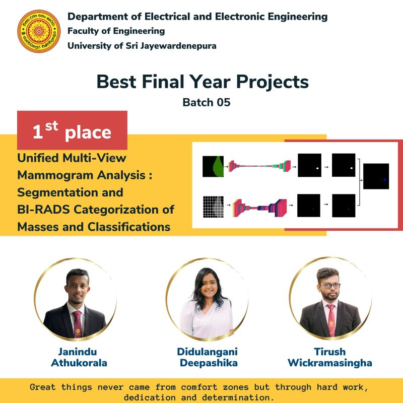
</p>

---

## 📖 Project Overview

Mammographic analysis requires identifying abnormalities such as **breast masses** and **calcifications**, which differ substantially in size, structure, and visual appearance.

A single processing pathway is therefore not ideal for both abnormality types.

This project develops a multi-stage framework consisting of:

1. **Image standardization and abnormality-specific enhancement**
2. **Dual-path segmentation for masses and calcifications**
3. **Post-processing and ROI fusion**
4. **Multi-view deep feature extraction**
5. **BI-RADS classification using CC and MLO information**

The system was evaluated using the **INBreast** mammography dataset.

> This repository represents an academic research and engineering project and is not intended for clinical diagnosis or treatment decisions.

---

## 📊 Key Results

| Stage | Method | Result |
|---|---|---:|
| **Multi-View Classification** | EfficientNetB3 + ANN | **87.55% Accuracy** |
| **Mass Segmentation** | Modified HTU-Net | **0.6064 DSC** |
| **Mass Segmentation** | Modified HTU-Net | **0.5988 Precision** |
| **Calcification Segmentation** | U-Net | **0.8022 DSC** |
| **Calcification Segmentation** | U-Net | **0.8958 Precision** |
| **Mass Enhancement** | Proposed B-G Fusion Pipeline | **Up to 72% CNR Improvement** |
| **Calcification Enhancement** | Proposed Gaussian-Based Pipeline | **Up to 46% PSNR Improvement** |

> Enhancement improvements correspond to the comparison settings used in the associated preprocessing study and should be interpreted relative to those evaluated baseline methods.

---

## 🏗️ System Architecture

The project combines preprocessing, segmentation, reconstruction, feature extraction, and multi-view classification within a unified pipeline.

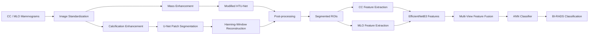

---

# 🧩 Methodology

## 1. Image Preprocessing

The preprocessing stage standardizes mammograms while preserving anatomical structure before enhancement and downstream model inference.

### Dataset

The framework was evaluated using the **INBreast dataset**, which contains high-resolution mammograms in DICOM format together with abnormality annotations.

The dataset includes:

- **Cranio-Caudal (CC)** views
- **Mediolateral Oblique (MLO)** views
- Mass annotations
- Calcification annotations

### Standardization

The preprocessing pipeline includes:

- DICOM-to-image conversion
- Breast-region extraction using largest-contour detection
- Pectoral-region handling for MLO images
- Aspect-ratio-preserving resizing
- Standardization to **1024 × 1024 pixels**
- Laterality-aware zero-intensity padding

These operations standardize the dataset while minimizing geometric distortion.

<p align="center">
  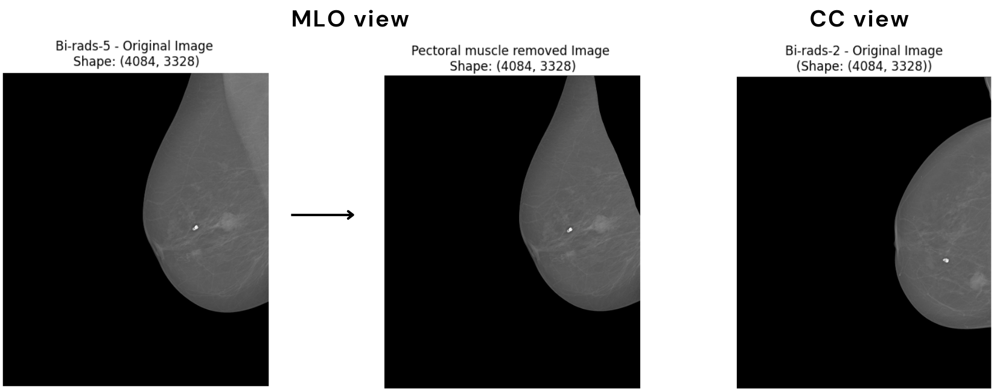
</p>

<p align="center">
  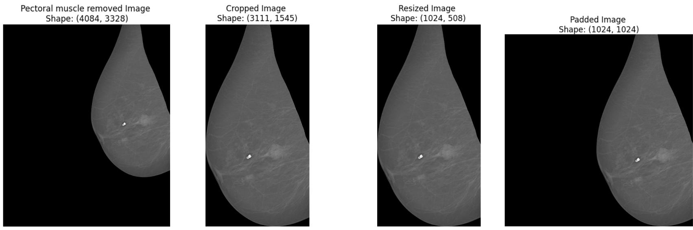
</p>

---

## 2. Dual-Path Image Enhancement

Masses and calcifications have substantially different visual characteristics.

The framework therefore uses separate enhancement pipelines optimized for each abnormality type.

### Mass Enhancement

The mass-enhancement pipeline applies:

1. **Contrast Limited Adaptive Histogram Equalization (CLAHE)**
2. Global intensity thresholding
3. **Magma colour mapping**
4. RGB channel decomposition
5. Pairwise channel fusion:
   - R-G
   - R-B
   - B-G

The **B-G fused representation** produced the most balanced enhancement performance across the evaluated image-quality metrics and was selected for downstream mass segmentation.

<p align="center">
  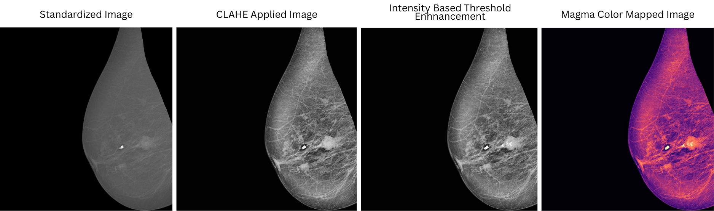
</p>

<p align="center">
  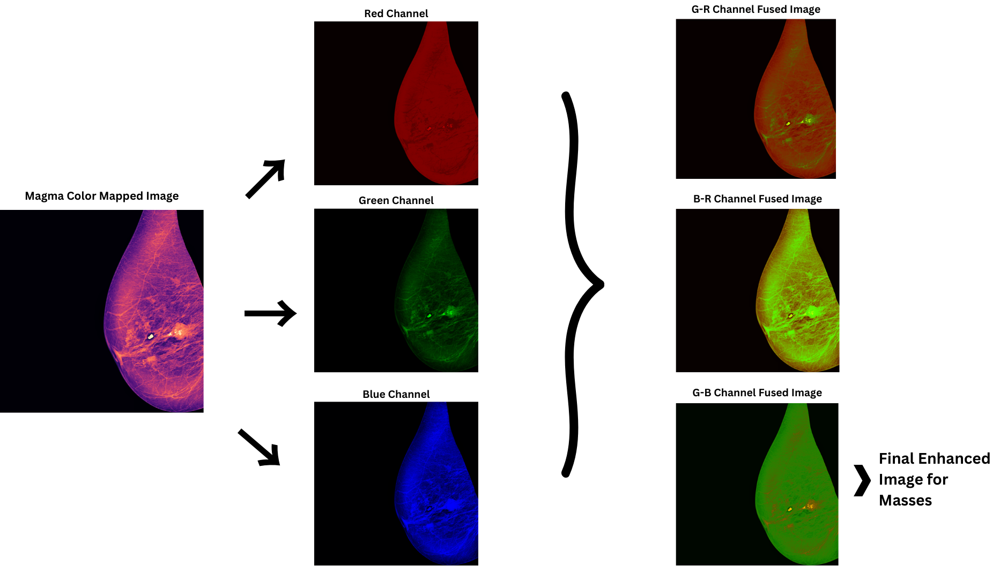
</p>

### Calcification Enhancement

Calcifications are small, high-intensity structures and require a different enhancement strategy.

The calcification pipeline applies:

1. Gaussian low-pass filtering
2. Subtraction from the standardized mammogram to extract high-frequency components
3. Rectification of negative responses
4. Secondary Gaussian smoothing
5. Adaptive thresholding
6. Binary-mask generation
7. Overlay on the standardized mammogram

<p align="center">
  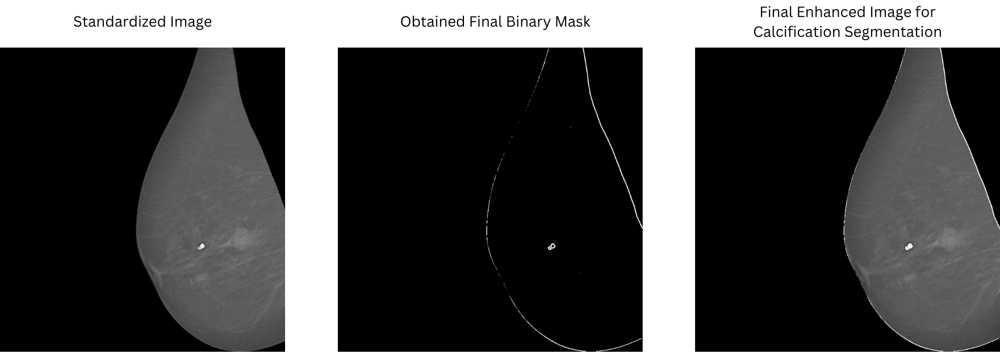
</p>

### Enhancement Results

The proposed enhancement approaches produced:

- **Up to 72% improvement in CNR** for breast-mass enhancement
- **Up to 46% improvement in PSNR** for calcification enhancement

against the evaluated conventional enhancement baselines.

---

# 3. Dual-Path Segmentation

Masses and calcifications differ significantly in morphology, scale, and distribution.

A **dual-path segmentation framework** was therefore developed instead of forcing both abnormalities through the same model architecture.

```text
Mass-Enhanced Mammogram
        ↓
Modified HTU-Net
        ↓
Mass Mask

Calcification-Enhanced Mammogram
        ↓
Overlapping Patches
        ↓
U-Net
        ↓
Hanning-Window Reconstruction
        ↓
Calcification Mask

Mass Mask + Calcification Mask
        ↓
Post-processing & Fusion
```

---

## Mass Segmentation — Modified HTU-Net

Breast masses are segmented using a modified **Hybrid Transformer U-Net (HTU-Net)**.

The architecture combines convolutional feature extraction with transformer-based attention.

### Architectural Modifications

- Encoder-decoder architecture based on U-Net
- **Spatial-Channel Enhanced Self Attention (SCESA)**
- **Multi-Head Attention (MHA)** at the bottleneck
- Depthwise convolution within the attention mechanism
- Conv2D-based positional representation
- Preservation of 2D spatial feature maps rather than conventional transformer patch flattening

These modifications were designed to capture both local structural information and broader contextual relationships.

### Performance

| Metric | Result |
|---|---:|
| Dice Similarity Coefficient | **0.6064** |
| Precision | **0.5988** |

<p align="center">
  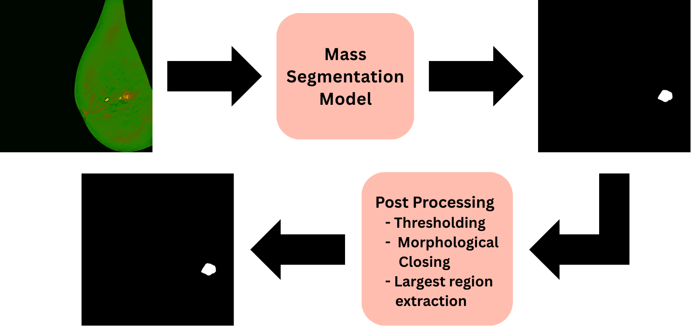
</p>

---

## Calcification Segmentation — U-Net + Patch Reconstruction

Calcifications occupy very small regions relative to the full-resolution mammogram.

To preserve fine details, calcification segmentation uses an overlapping patch-based strategy.

### Patch Configuration

- Patch size: **64 × 64 pixels**
- Stride: **32 pixels**
- Overlapping patch extraction
- U-Net segmentation
- Weighted image reconstruction

### Hanning-Window Reconstruction

Predicted patches are merged using a **cosine-based Hanning window**.

This weighted reconstruction:

- smooths transitions between overlapping patches
- reduces patch-boundary artifacts
- improves continuity in the reconstructed segmentation mask

### Performance

| Metric | Result |
|---|---:|
| Dice Similarity Coefficient | **0.8022** |
| Precision | **0.8958** |

<p align="center">
  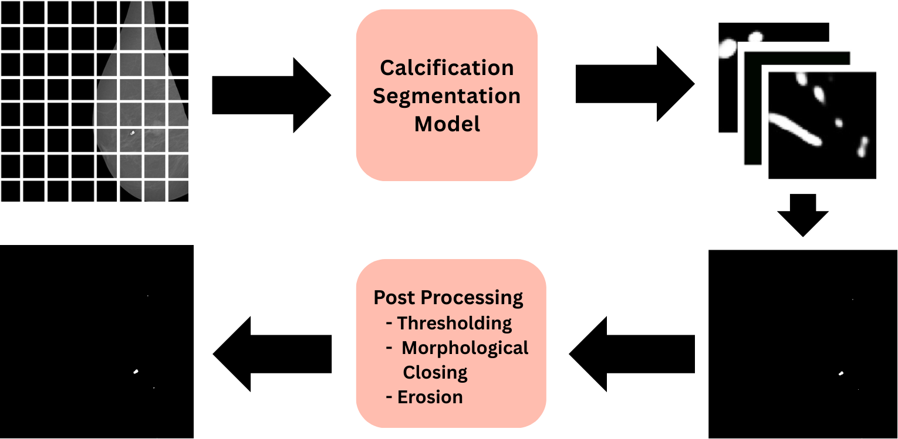
</p>

---

## Post-processing and Output Fusion

Different post-processing strategies are applied to the two segmentation paths.

### Mass Masks

- Probability thresholding
- Binary-mask generation
- Removal of small isolated regions
- Morphological closing
- Largest-connected-component selection

### Calcification Masks

- Reconstruction of overlapping segmentation patches
- Morphological processing
- Breast-boundary suppression
- Mask normalization and refinement

The final system overlays the processed outputs from both pathways to generate a unified abnormality representation.

<p align="center">
  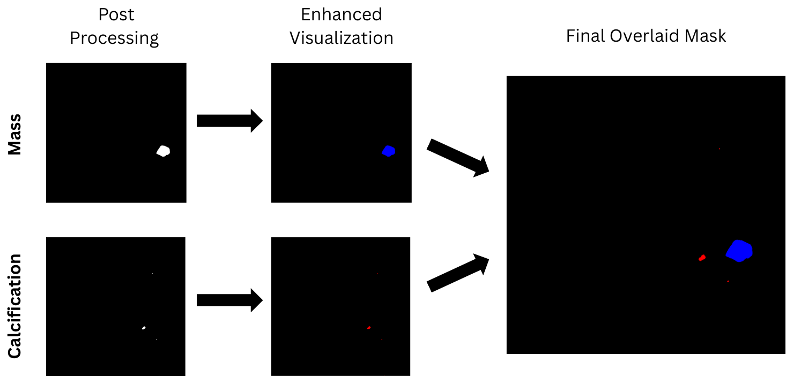
</p>

### Segmentation Results

<p align="center">
  
</p>

<p align="center">
  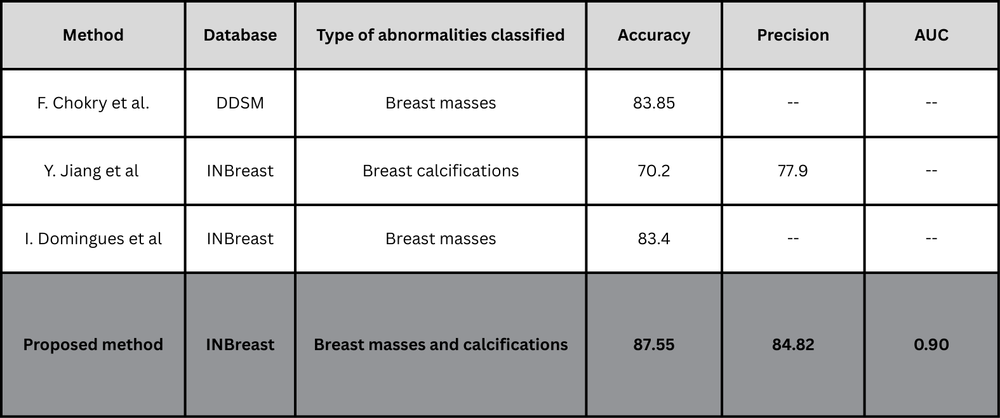
</p>

---

# 4. Multi-View Classification

After preprocessing and ROI analysis, the framework performs classification using complementary information from the **CC and MLO mammographic views**.

Multiple classification approaches were evaluated, including:

- Single-view CNN
- Multi-view CNN
- **EfficientNetB3 + ANN**

The EfficientNetB3-based approach was selected for the final classification pipeline.

---

## EfficientNetB3 Feature Extraction

A pre-trained **EfficientNetB3** backbone is used for deep feature extraction.

The classification workflow consists of:

1. Processing mammographic views through EfficientNetB3
2. Global average pooling
3. Extraction of deep feature vectors
4. Fusion of information from complementary mammographic views
5. Classification using dense ANN layers

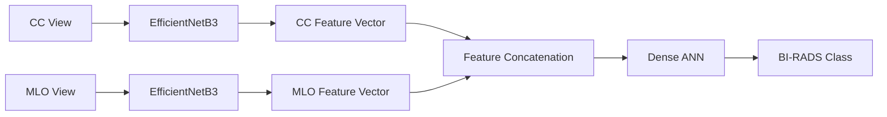

### Training Configuration

- ImageNet-pretrained EfficientNetB3
- Fine-tuning on mammographic data
- Global average pooling
- Multi-view feature concatenation
- Dense ANN classifier
- Adam optimizer
- Learning rate: **0.0005**
- **5-fold cross-validation**


---

## Class-Imbalance Handling

The BI-RADS categories are not uniformly represented within the dataset.

An enhanced **SMOTE strategy with adaptive nearest-neighbor selection** was used to improve class balance during model development.

---

## Classification Results

The final multi-view classification pipeline achieved:

### **87.55% Classification Accuracy**

<p align="center">
  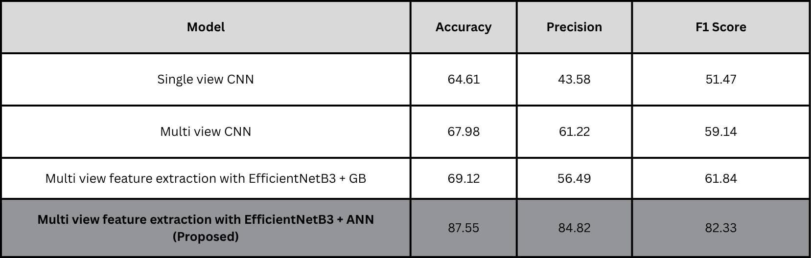
  
</p>

---

# 🔬 Key Contributions

The project contributes a unified framework spanning multiple stages of mammogram analysis:

1. **Abnormality-specific enhancement pipelines** for masses and calcifications
2. **Dual-path deep learning segmentation** using modified HTU-Net and U-Net
3. **Hanning-window weighted reconstruction** for patch-based calcification segmentation
4. **Multi-view deep feature extraction** using EfficientNetB3
5. **Feature-level fusion of CC and MLO mammographic information**
6. **ANN-based BI-RADS classification**
7. Quantitative evaluation across enhancement, segmentation, and classification stages

Rather than using a single model for all tasks, the framework applies specialized processing and learning strategies based on the structural characteristics of each abnormality and stage of analysis.

---

# 📄 Publications

This project contributed to three research publications covering preprocessing, segmentation, and classification.

### 1. A Unified Deep Learning Approach for the Segmentation of Breast Masses and Calcifications

**Authors:** **T.D. Wickramasingha**, S.A.A.J.M. Athukorala, S.M.D. Deepashika, I.A.S.I. Fernando, U.L. Wijewardhana, U.B. Balagalla  
**Conference:** MERCon 2025  
**Focus:** Unified segmentation of breast masses and calcifications using modified HTU-Net and U-Net.

📄 [IEEE Xplore](https://ieeexplore.ieee.org/document/11217096)

---

### 2. Dual-Path Enhancement Framework for Masses and Calcifications in Mammograms

**Authors:** S.A.A.J.M. Athukorala, S.M.D. Deepashika, **T.D. Wickramasingha**, et al.  
**Conference:** TENCON 2025  
**Focus:** Quantitative evaluation of abnormality-specific mammogram enhancement pipelines.

📄 [IEEE Xplore](https://ieeexplore.ieee.org/document/11375512)

---

### 3. Multi View Mammogram Analysis with Segmented Breast Masses and Calcifications for BI-RADS Classification

**Authors:** S.M.D. Deepashika, **T.D. Wickramasingha**, et al.  
**Conference:** ICARC 2026  
**Focus:** Integration of preprocessing, segmentation, and multi-view classification for BI-RADS categorization.

📄 [IEEE Xplore](https://ieeexplore.ieee.org/document/11453577)

---

# 🏆 Recognition

### Best Final Year Project

**Unified Multi-View Mammogram Analysis**

Department of Electrical and Electronic Engineering  
University of Sri Jayewardenepura, Sri Lanka

The project received the department's **Best Final Year Project** recognition.

---

# 🧰 Technology Stack

### Deep Learning
- PyTorch
- TensorFlow
- EfficientNetB3
- Modified HTU-Net
- U-Net
- Artificial Neural Networks

### Computer Vision & Image Processing
- OpenCV
- CLAHE
- Gaussian filtering
- Magma colour mapping
- Morphological processing
- Hanning-window patch reconstruction

### Evaluation
- Dice Similarity Coefficient
- Precision
- CNR
- SBR
- SSIM
- PSNR
- Cross-validation

### Programming
- Python
- NumPy
- Scikit-learn

---

# ⚠️ Research Use Disclaimer

This project was developed for **academic research and engineering evaluation**.

It is **not a medical device** and should not be used independently for clinical diagnosis, screening, treatment, or patient-management decisions.

The reported results were obtained under the dataset, preprocessing, experimental, and validation conditions used during this research.

---

# 🚀 Future Work

Potential extensions include:

- Validation on additional multi-institutional mammography datasets
- External validation across different imaging systems and populations
- Explainability methods such as **Grad-CAM**
- Improved uncertainty estimation
- Further optimization of multi-view feature fusion
- Expanded malignancy-related classification tasks
- Evaluation of deployment-oriented inference pipelines

---

# 🤝 Acknowledgements

- **INBreast** — Mammography dataset used for model development and evaluation
- **PyTorch** — Deep learning framework used across model development
- **TensorFlow / Keras** — Model development and EfficientNet-based experimentation
- **OpenCV** — Image preprocessing and computer-vision operations
- **University of Sri Jayewardenepura** — Academic supervision and project support

---

# 👤 Author

**Tirush Dumil Wickramasingha**

[GitHub](https://github.com/Tirush-Leo) •
[LinkedIn](https://www.linkedin.com/in/tirush-dumil/) •
[Google Scholar](https://scholar.google.com/citations?user=WRrjwsoAAAAJ&hl=en)
